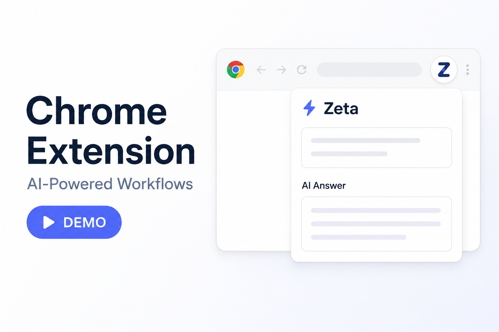

# ⚡ Zeta — AI Assistant Chrome Extension

> Highlight any text on any webpage, press **Ctrl+I**, and get an AI-generated answer instantly — without leaving the page.

Built during my internship at **Cvent** to speed up research and reduce context-switching while reading technical documentation.

---

## Demo

[](https://www.loom.com/share/278ac45c19da43ec9c2c6f707f78483b)

---

## What it does

Zeta is a Chrome extension that acts as a contextual AI assistant. Select any text on a webpage, trigger the popup with a keyboard shortcut or right-click menu, and receive an AI-generated answer — all within the same tab.

The extension communicates with a lightweight Flask backend that handles the API call and returns the response. Built in two iterations: v1.0 was a basic proof-of-concept; v2.0 added caching, improved UX, and a more robust backend integration.

---

## Architecture

```
User selects text on webpage
        ↓
Chrome Extension (content.js)
  — intercepts Ctrl+I shortcut
  — captures selected text
        ↓
Background Service Worker (background.js)
  — sends POST request to Flask backend
        ↓
Flask Backend (flask_app.py)
  — validates request
  — calls AI API (OpenAI / configurable)
  — returns response JSON
        ↓
Popup UI (popup.html / popup.js)
  — renders answer with loader animation
  — copy-to-clipboard button
```

---

## Features

- **Select & Ask** — highlight any text and get an instant AI answer via keyboard shortcut (`Ctrl+I` / `Cmd+I`) or right-click context menu
- **v1.0 → v2.0** — v2.0 added response caching, improved error handling, and a cleaner popup UI
- **Flask backend** — separates the AI call logic from the extension, making it easy to swap AI providers
- **Loader animation** — visual feedback while the response is being fetched
- **Copy to clipboard** — one-click copy of any AI response
- **Configurable endpoint** — point it at any compatible AI backend by updating one line in `background.js`

---

## Tech stack

| Layer | Technology |
|---|---|
| Extension frontend | HTML, CSS, Vanilla JavaScript (ES6+) |
| Background logic | Chrome Extensions API (Manifest V3), Service Workers |
| Backend | Python, Flask |
| AI integration | OpenAI API (configurable) |
| Communication | REST (JSON) |

---

## Repository structure

```
chrome-extension-ai-assistant-zeta/
├── v1.0/               # Initial version — basic select & query flow
│   ├── manifest.json
│   ├── content.js
│   ├── popup.html / popup.js / popup.css
│   └── background.js
├── v2.0/               # Production version — caching, improved UX
│   ├── manifest.json
│   ├── content.js
│   ├── popup.html / popup.js / popup.css
│   ├── background.js
│   └── flask_app.py    # Backend server
├── LICENSE
└── README.md
```

---

## Run it locally

### 1. Start the backend

```bash
cd v2.0
pip install flask openai python-dotenv
```

Create a `.env` file:
```
OPENAI_API_KEY=your_key_here
```

```bash
python flask_app.py
# Server runs at http://localhost:5000
```

### 2. Load the extension in Chrome

1. Go to `chrome://extensions/`
2. Enable **Developer Mode** (top right)
3. Click **Load Unpacked**
4. Select the `v2.0/` folder

### 3. Configure the endpoint

In `v2.0/background.js`, update the API URL to point to your running Flask server:

```js
const API_ENDPOINT = "http://localhost:5000/ask";  // or your deployed URL
```

### 4. Use it

- Select any text on a webpage
- Press `Ctrl+I` (or `Cmd+I` on Mac), or right-click → "Ask Zeta"
- Answer appears in the popup

---

## Background

This was built during my internship at **Cvent**, where I was spending a lot of time reading internal documentation across multiple tools. The goal was to surface contextual answers without switching tabs or copying text into a separate chat window.

The v1.0 prototype was functional within a day. v2.0 introduced response caching to avoid redundant API calls for repeated queries, better error states, and a cleaner popup design.

> Note: The production version at Cvent used internal enterprise APIs. This repository contains a public version configured to work with OpenAI's API — swap the backend endpoint in `flask_app.py` to connect to any compatible provider.

---

## What I'd build next

- [ ] Support for multiple AI providers (Gemini, Claude, local Ollama models)
- [ ] Page summarisation mode — summarise the entire current page, not just a selection
- [ ] Chrome Web Store publishing with user-configurable API key input

---

## License

[MIT](LICENSE) — use it, fork it, build on it.

---

Made by [Saumya Garg](https://linkedin.com/in/saumya-garg-1ab39224b) · [GitHub](https://github.com/saumya-2409)
